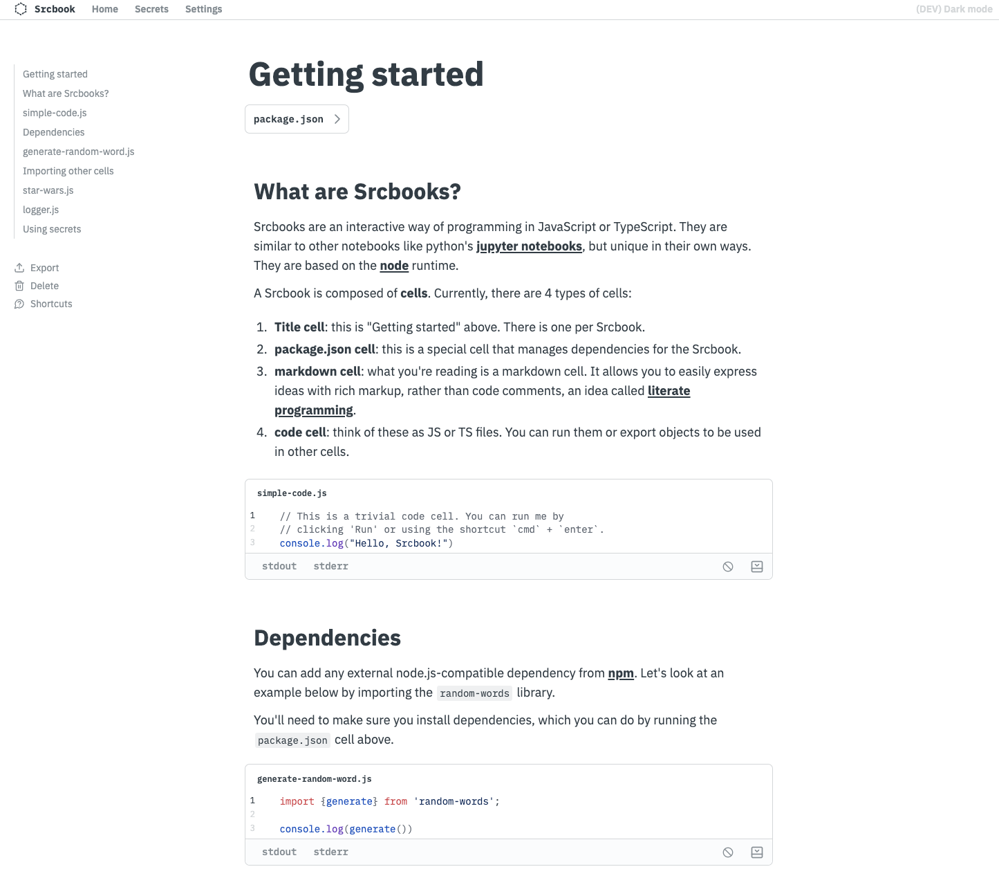

# Srcbook

Srcbooks are interactive notebooks for JavaScript & TypeScript. They allow you to create, run and share reproduceable programs and ideas.

Srcbook runs locally on your machine and is fully open-source under the Apache2 license.

Under the hood, Srcbook creates folders on your local machine and provides a web interface (also running locally) as a programming environment.

Srcbooks export to markdown using the `.src.md` extension. These files can easily be shared, versioned, and rendered in any environment that supports Markdown, like your editor or GitHub UI.

To learn more, try out the interactive tutorial which is itself a Srcbook by clicking "Getting Started" when launching the application.

#### ⚠️ Warning

Srcbook is currently in alpha which means there may be breaking changes until it's out of alpha.

If you upgrade and are having trouble launching the application, you can `rm -rf ~/.srcbook` to clear the Srcbook directory and start from a clean state. This will, however, delete all your Srcbooks so you may want to first export any you care about to a `.src.md` file.



## Requirements

Srcbook requires node v20+. We highly recommend using [nvm](https://github.com/nvm-sh/nvm) to manage local node versions.

## Install

You can install the `srcbook` application from `npm`:

```bash
npm install -g srcbook
```

And then run it:

```
srcbook
```

You can also run it directly using `npx`:

```bash
# Using npx
npx srcbook

# Using pnpm
pnpm dlx srcbook
```

## Update

You can update `srcbook` using `npm`:

```bash
npm update -g <package_name>
```

## Uninstall

You can remove srcbook by first removing the package, and then cleaning it's local directory on disk:

```bash
npm uninstall -g srcbook
rm -rf ~/.srcbook
```

## Analytics and tracking

In order to improve Srcbook, we collect some behavioral analytics. We don't collect anything personal or identifiable, our goals are simply to improve the application. The code is open source so you don't have to trust us, you can verify! You can find more information in our [privacy policy](./PRIVACY-POLICY.md).

If you want to disable tracking, you can do so in the settings page of the application.

## Development

For development instructions, see [CONTRIBUTING.md](./CONTRIBUTING.md).
