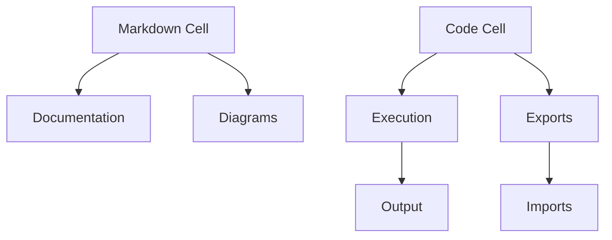

<!-- srcbook:{"language":"typescript"} -->

# Srcbook Features

Srcbook combines several powerful features to create a unique development environment. This guide explores each major feature area with practical examples.

## AI Integration

Srcbook's AI capabilities act as a pair programmer, helping you develop faster and smarter.

### AI Providers

- Anthropic (recommended with claude-3-5-sonnet-latest)
- OpenAI
- Local models via Ollama

### AI Features

1. **Generate Complete Srcbooks**
   - Create full applications from descriptions
   - Generate tutorial notebooks
   - Build example implementations

2. **Cell Generation**
   - Create new code cells from descriptions
   - Generate documentation
   - Implement specific functionality

3. **Code Editing**
   - Refactor existing code
   - Fix bugs
   - Add features
   - Improve documentation

Example of AI-assisted bug fixing:

###### buggy-code.ts

```typescript
function fibonacci(n: number): number {
  if (n <= 1) return n;
  return fibonacci(n - 1) + fibonacci(n - 2);
}

// Bug: Stack overflow for large n
console.log(fibonacci(50));
```

Use the sparkles icon and ask AI to "optimize this code to handle large numbers efficiently" for a memoized solution.

## Interactive Notebook Interface

### Cell Types

1. **Markdown Cells**
   - Rich text formatting
   - Code syntax highlighting
   - Tables and lists
   - Task lists
   - Math equations
   - Mermaid diagrams

Example mermaid diagram:



2. **Code Cells**
   - TypeScript/JavaScript execution
   - File-based organization
   - Module imports/exports
   - npm package support
   - Real-time type checking

### Cell Features

- Hot reload on changes
- Error highlighting
- Console output
- Type information
- Export values
- Import from other cells

## TypeScript Integration

### Type System

Full TypeScript support with:
- Type checking
- Interface definitions
- Generic types
- Module type declarations
- JSDoc comments

Example:

###### types.ts

```typescript
/** Represents a user in the system */
interface User {
  id: string;
  name: string;
  email: string;
  preferences: UserPreferences;
}

/** User preference settings */
interface UserPreferences {
  theme: 'light' | 'dark';
  notifications: boolean;
  language: string;
}

/** User management functions */
class UserManager {
  private users: Map<string, User> = new Map();

  addUser(user: User): void {
    this.users.set(user.id, user);
  }

  getUser(id: string): User | undefined {
    return this.users.get(id);
  }
}
```

### Configuration

Custom TypeScript configuration via tsconfig.json:

###### tsconfig-example.json

```json
{
  "compilerOptions": {
    "target": "ES2020",
    "module": "ESNext",
    "strict": true,
    "esModuleInterop": true,
    "skipLibCheck": true,
    "forceConsistentCasingInFileNames": true
  }
}
```

## Package Management

### Dependencies

- npm package support
- Version management
- Automatic installation
- Import/export system

Example package.json with common dependencies:

###### package.json

```json
{
  "type": "module",
  "dependencies": {
    "axios": "^1.6.0",
    "zod": "^3.22.0",
    "date-fns": "^2.30.0",
    "lodash-es": "^4.17.21"
  },
  "devDependencies": {
    "@types/lodash-es": "^4.17.12"
  }
}
```

### Module System

ES Modules support with cell imports:

###### api-client.ts

```typescript
import axios from 'axios';

export async function fetchData<T>(url: string): Promise<T> {
  const response = await axios.get<T>(url);
  return response.data;
}
```

###### use-api.ts

```typescript
import { fetchData } from './api-client.ts';

interface Todo {
  id: number;
  title: string;
  completed: boolean;
}

// Fetch and display a todo
const todo = await fetchData<Todo>('https://jsonplaceholder.typicode.com/todos/1');
console.log(todo);
```

## Export and Share

### File Format

- Standard markdown compatibility
- Executable code blocks
- Version control friendly
- Portable between environments

### Sharing Options

1. **Export as .src.md**
   - Share via Git
   - Send via email
   - Post on GitHub
   - Include in documentation

2. **Import Options**
   - Local files
   - Git repositories
   - URLs
   - Hub examples

### Hub Integration

Access community examples:

```bash
npx srcbook@latest import web-scraping-with-puppeteer
```

## Security Features

### Secrets Management

- Secure storage of API keys
- Environment variable access
- No secrets in code cells

Example:

###### secure-api.ts

```typescript
// Access secrets via process.env
const apiKey = process.env.API_KEY;
const apiSecret = process.env.API_SECRET;

if (!apiKey || !apiSecret) {
  throw new Error('Missing API credentials');
}

// Use secrets securely
console.log('API configured with:', 
  apiKey.substring(0, 4) + '...' + apiKey.substring(apiKey.length - 4));
```

## Analytics and Privacy

- Optional usage tracking
- No PII collection
- Configurable settings
- Open-source verification

Disable analytics:

```bash
SRCBOOK_DISABLE_ANALYTICS=true srcbook start
```

## Next Steps

- Try the [Getting Started](./getting-started.src.md) guide
- Explore [Examples](./examples.src.md)
- Read the [API Reference](./api-reference.src.md)
- Join the [Discord](https://discord.gg/shDEGBSe2d) community